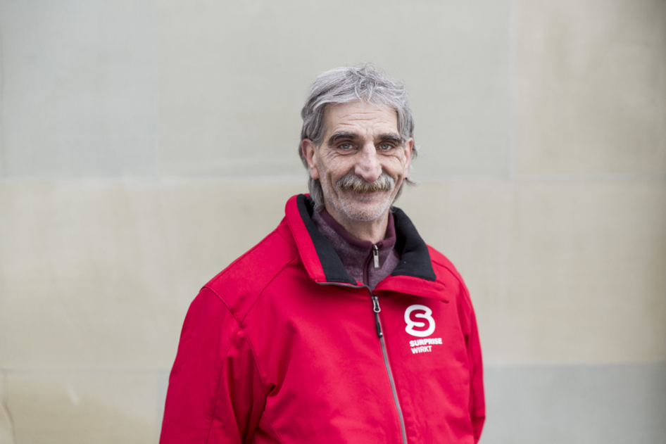
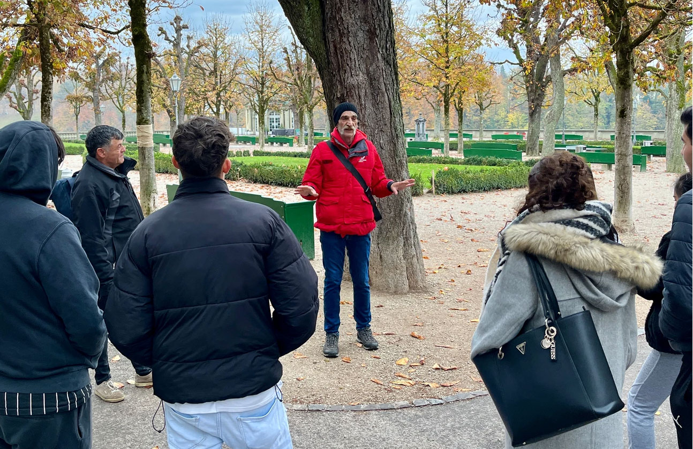

+++
title = "Stadtführungen die Leben verändern"
date = "2024-02-23"
draft = false
pinned = false
image = "screenshot-2024-02-23-095751.jpg"
description = "Vom Adoptivvater geschlagen, vom Drogenkonsum geprägt, nachdem Roger Meier 22 Jahre auf der Gasse gelebt hat, wandte sich seine Lebensgeschichte dank Surprise zum Guten.\n\n"
+++
``\
Vom Adoptivvater geschlagen, vom Drogenkonsum geprägt, nachdem Roger Meier 22 Jahre auf der Gasse gelebt hat, wandte sich seine Lebensgeschichte dank Surprise zum Guten.\
``

Elias Stamatiadis, Malou Gygax

Roger Meier (64) ist vom Leben gezeichnet. Er hatte es in seinem Leben nicht leicht. Seine Eltern konnte er nie kennenlernen und bei seiner Pflegefamilie wurde er geschlagen und misshandelt. Durch die Schwierigkeiten in seinem Leben, ist Roger bei den Drogen gelandet. Dank dem Verein Surprise konnte er sich wieder ein geregeltes Leben aufbauen. Roger führt bei Surprise Stadtrundgänge durch und erzählt dabei seine Geschichte. Surprise bietet in Basel, Bern und Zürich viele verschiedene Angebote an und setzt sich für Menschen ein, die von Armut oder sozialer Ausgrenzung betroffen sind. Am bekanntesten ist wohl ihr Strassenmagazin.

### 1. Von der Wiege auf die Strasse

Es ist Freitagmorgen. Vor dem Stadtrundgang bleibt noch etwas Zeit. Die kleine Gruppe wartet draussen in der Kälte vor dem Berner Münster. Am Rand der Strassen liegt verregneter Schnee. Das Wetter erinnert an einen typischen Dezembertag. Roger Meier unterbricht die Stille. “Heute darf ich noch zum Zahnarzt gehen, ich bekomme jeden Herbst ein neues Gebiss”, sagt er freudig. Der 64-jährige ist von mittlerer Statur, hat markante Gesichtszüge, die von einem ereignisreichen Leben zeugen. Besonders auffallend sind seine klaren, leuchtenden und wachen Augen. Er wirkt sympathisch und offen. Seine lockere und herzliche Art lässt grinsende Gesichter in der kleinen Gruppe strahlen. Als die letzten Teilnehmenden eintreffen, beginnt Roger mit der Stadtführung. Als Roger Meier im Val de Travers auf die Welt kam, begann das Leben bereits mit einem Schicksalsschlag. Er wurde nie von seinen Eltern auf der Kinderstation abgeholt. Seine ersten fünf Lebensjahre wurde er im Spital von den Krankenpflegenden aufgezogen. Dann kam er in eine Adoptivfamilie im Aargau, wo er aber nur als billige Arbeitskraft gesehen und körperlich wie auch psychisch fertig gemacht wurde. “Meine Kindheit war geprägt von Gewalt, psychischer und körperlicher Gewalt,” erzählt Roger den gebannt zuhörenden Teilnehmenden des Rundgangs.  Er folgte dem Beruf seines Adoptivvaters und erlernte unfreiwillig Müller. Als er einmal nach der Arbeit nach Hause kam, spürte er schon, wie sein Pflegevater hinter der Tür stand, auf ihn wartete und ihn wieder abschlagen wollte. Normalerweise, als Roger dieses Gefühl spürte, hatte er sich zurückgezogen und bei seinem Nachbarn im Heustock versteckt, doch nicht in dieser Nacht; er hatte die Türe aufgerissen und da hat sein Pflegevater schon auf ihn gewartet. Sie sind aufeinander losgegangen. Nach zwölfeinhalb Jahren Demütigung hat sich Roger das erste Mal gegen seinen Pflegevater gewehrt. Die Mutter schrie, dass Roger seinen Pflegevater in Ruhe lassen soll. Gerade als Roger ihm eine Waage über den Kopf schleudern wollte, hatte er wieder angefangen zu realisieren, was er da tat. Der Pflegevater lag am Boden. Er rührte sich nicht. Überall war Blut. Roger kann sich noch an die Panik erinnern, die in ihm aufkam, als er dachte, dass sein Vater tot sei. Obschon dies nicht der Fall war, sah Roger nur einen einzigen Ausweg, der für ihn in Frage kam; er flüchtete. Von diesem Zeitpunkt an lebte Roger Meier, mit seinen jungen 17 Jahren, obdachlos. 

> “Meine Kindheit war geprägt von Gewalt, psychischer und körperlicher Gewalt.” 
>
> *Roger Meier*

### 2.  “Surprise wirkt”

Über 22 Jahre lebte Roger auf der Strasse. Der Beginn dieses Lebensabschnittes war vom eigenen Drogenkonsum geprägt und Roger hat sich weitgehend alleine durchgeschlagen. Als im Jahr 1991 die Drogenszene von der kleinen Schanze in den Kocherpark verschoben wurde, hatte er begonnen, für die Suchtberatung der Stadt Bern zu arbeiten. Voraussetzung dafür war, dass er sich verpflichtete, keine Drogen mehr zu nehmen. Die Zusage markierte gleichzeitig das Ende seines Drogenkonsums. Als Obdachloser hatte er somit eine Arbeit mit festem Lohn und bezahlten Ferien. Eine der wichtigsten Aufgaben als Streetworker bestand darin, dafür zu sorgen, dass es zu keinen Drogentoten kam. Dazu musste Roger mehrere Wiederbelebungen pro Tag durchführen. Mit der Auflösung der offenen Drogenszene wechselte Roger seine Arbeit. Er verdiente fortan sein Geld auf dem Bau, zeitweise auch in seiner eigenen Baufirma, die er mit Kollegen gegründet hatte. Als Surprise vor sieben Jahren auf Roger Meier zukam und ihn fragte, ob er soziale Stadtrundgänge in der Stadt Bern machen will, war es für ihn von Anfang an klar. Er macht mit! Er hat den Arbeitsvertrag unterschrieben, eine Ausbildung als Stadtführer gemacht sowie Sprach- und Schauspielunterricht besucht. Dank seinen Stadtführungen und dem Verkauf des Surprise Magazins, hatte er einen guten Lohn. “Wenn Surprise nicht wäre, dann wäre ich niemals da wo ich bin,” meint Roger Meier. Obwohl er sich durch dieses Einkommen theoretisch eine Wohnung hätte leisten können, war dies nicht möglich. Denn für einen Mietvertrag fehlte ihm eine Wohnadresse. Glücklicherweise bekam er bald darauf einen Anruf vom Verein “Wohnen Bern” und es wurde ihm eine kleine Wohnung angeboten. Als Roger den Preis hörte, wusste er, dass er es sich leisten konnte. Durch den Briefkasten war er wieder erreichbar, konnte ein Bankkonto errichten und wieder eine Identitätskarte machen. Die Wohnung hat ihm Vieles erleichtert.

> “Wenn Surprise nicht wäre, dann wäre ich niemals da wo ich bin.” 
>
> *Roger Meier*

### 3. Der Verein Surprise

Die Vision von Surprise ist eine Schweiz ohne Armut und soziale Ausgrenzung. Mit verschiedenen Angeboten sollen Menschen in Armut oder sozial benachteiligte Menschen unterstützt werden. Dazu gehören Möglichkeiten zum Geldverdienen oder die Teilnahme an gesellschaftlichen Anlässen. Auch die Aufklärung der Öffentlichkeit in Bezug auf Armut und soziale Gerechtigkeit gehört zu den Aufgaben, die Surprise übernimmt. Die Idee stammt ursprünglich von mehreren Personen, die selbst von Armut betroffen waren. Sie wussten, wie schnell man in die Armut rutschen kann und wollten Menschen in ähnlichen Situationen helfen. Der Verein wurde im Jahr 1998 gegründet. Am bekanntesten ist wohl die Zeitschrift “Surprise”. Jährlich werden rund 500’000 Exemplare verkauft. Der Monat Dezember ist mit Abstand der verkaufsstärkste Monat. So wurden im Dezember 2022 über 70’000 Strassenmagazine verkauft. Wer die Zeitschrift verkaufen möchte, kann sich bei Surprise melden. So gehören beispielsweise auch pensionierte Menschen, welche ihre Rente aufbessern möchten, zum Verkaufsteam. Ungefähr die Hälfte des Verkaufspreises, der aktuell bei 8 Franken liegt, können sie als Lohn behalten. Es gibt Menschen, die bis zu tausend Hefte pro Monat verkaufen. Dadurch können Sie sich den Lebensunterhalt verdienen.

### 4. Soziale Aktivitäten

Neben dem Strassenmagazin und den Stadtrundgängen gehören auch soziale Aktivitäten zum Angebot von Surprise. Solche sind wichtig, dass die Betroffenen Möglichkeiten erhalten, Anschluss an das gesellschaftliche Leben erhalten und Selbstvertrauen gewinnen. Und schlussendlich nicht mehr am Rand der Gesellschaft sind, sondern wieder integriert sind. Surprise organisiert zum Beispiel die Schweizer Strassenfussball-Liga, an welcher verschiedene Institutionen aus der ganzen Schweiz teilnehmen können. Menschen in schwierigen Lebenslagen erhalten dadurch Struktur und sportlichen Ausgleich. Es gibt sogar eine jährliche Weltmeisterschaft, die  im Jahre 2023 in Sacramento in Kalifornien stattfand. Man muss aber nicht so weit reisen, um in Berührung mit einem sozialen Angebot von Surprise zu kommen. In verschiedenen Restaurants und Cafés in der Deutschschweiz gibt es das Konzept “Café Surprise”. Wie funktioniert das? Ganz einfach, du bestellst einen Kaffee und bezahlst zwei. Dieser spendierte Kaffee wird auf einer Tafel mit einem Strich markiert. Diese Tasse Solidarität kann dann von einer bedürftigen Person konsumiert werden und dadurch am gesellschaftlichen Leben wieder ein wenig teilnehmen. Eine einfache Idee mit grosser Wirkung. Der Besuch eines  “Café Surprise” wäre auch der perfekte Ort, um die gewonnenen Eindrücke des besonderen Stadtrundgangs nachwirken zu lassen. Und wer weiss, vielleicht hat er sogar dein Leben ein wenig verändert.



**Obdachlose in der Schweiz**

2022 schätzt der Bund, dass schweizweit 2200 Menschen von Obdachlosigkeit betroffen sind und etwa 8000 von Wohnungsverlust bedroht werden. Hierbei gilt es aber zu beachten, dass man nur als obdachlos gilt, wenn man wirklich auf der Strasse schläft, wenn man jedoch z.B. bei Kolleg*innen im Keller oder im Auto wohnt, gilt man offiziell nicht als obdachlos.

