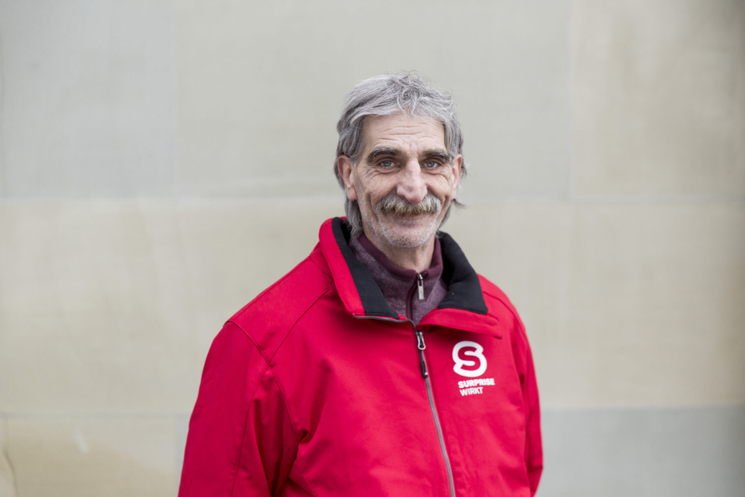

+++
title = "Überlebenskünstler seit Geburt"
date = "2024-02-26"
draft = false
pinned = false
image = "image.jpg"
description = "Vom Adoptivvater geschlagen, vom Drogenkonsum geprägt und doch seine Wünsche erfüllt. Roger Meier (64) gibt Einblicke in sein bewegtes Leben.\n"
+++
\
Vom Adoptivvater geschlagen, vom Drogenkonsum geprägt und doch seine Wünsche erfüllt. Roger Meier (64) gibt Einblicke in sein bewegtes Leben.



Elias Stamatiadis, Malou Gygax

Es ist Freitagnachmittag. Im Tibits in Bern am Bahnhof ist viel los. Die Kaffeemaschine brummt, Geschirr klirrt und überall sind freudige Menschen am plaudern. Roger Meier steht vor dem Eingang und redet mit einem Bekannten. Als er uns entdeckt, kommt er auf uns zu. Der 64-jährige ist von mittlerer Statur, hat markante Gesichtszüge, die von einem ereignisreichen Leben zeugen. Besonders auffallend sind seine klaren, leuchtenden und wachen Augen. Er wirkt sympathisch und offen. Mit einem Milchkaffee erzählt er dann von seiner Geschichte.

### Wir fangen bei der Kindheit an: Wie hat deine Kindheit deinen Lebenslauf geprägt? Gab es etwas, das dich besonders geprägt hat?

Meine Eltern haben mich im Spital gelassen und sind dann abgehauen. Keiner wollte mich und ich bin dann bei einer Pflegefamilie gelandet, die mich geschlagen hat. Also, meine Kindheit war geprägt von Gewalt, psychischer und körperlicher Gewalt. Ich habe niemandem vertraut und keinen an mich herangelassen. Wenn mich jemand berührt hat, bin ich zusammengezuckt. Man konnte mich nicht berühren. Das war so meine Kindheit.

> “Meine Kindheit war geprägt von Gewalt, psychischer und körperlicher Gewalt”. 
>
> *(Roger Meier)*

### **Und wie hast du dann den Ausweg gefunden?**

Ich habe eigentlich gar keinen Ausweg gefunden. Ich musste einen Beruf erlernen, den ich gar nicht wollte. Das hat mein Pflegevater für mich entschieden. Ich musste Müller lernen. Also musste ich mit 16 Jahren eine dreijährige Lehre absolvieren, die ich nicht wollte. Ich fing mit der Lehre an, habe mir aber überhaupt keine Mühe gegeben. Nach dem ersten Lehrjahr ging ich nach der Arbeit nicht mehr nach Hause, sondern in den Ausgang. Ich habe begonnen Alkohol zu trinken und bin dadurch gleich gewalttätig wie mein Pflegevater geworden. Ich habe meine Probleme mit meinen Fäusten geregelt und konnte mich am Morgen danach oftmals nicht mehr daran erinnern.

### Später hast du dann mit dem Drogenkonsum angefangen. Wie ist es dazu gekommen?

Nach der Lehre habe ich eine schlechte Entscheidung getroffen, die mich jetzt seit 44 Jahren begleitet. In einem besetzten Haus bin ich mit Heroin und anderen harten Drogen abgestürzt. Ich habe für Drogen täglich bis zu zweitausend Franken ausgegeben. Also habe ich Einbrüche begangen. An meinem zwanzigsten Geburtstag stand die Polizei vor mir und ich wurde verhaftet. Ich kam dann neun Monate in Untersuchungshaft. Das hiess: 24 Stunden am Tag allein sein, auf acht Quadratmetern. Ohne Radio, ohne Fernsehen, ohne Besuch, ohne Briefe, ohne irgendetwas. Der erste Monat war ohne medizinische Betreuung, ein kalter Entzug. Das war etwas vom härtesten, das ich bisher erlebt habe. Nach neun Monaten gaben mir Richter und Staatsanwalt einen Zettel, den ich unterschreiben sollte. Ich unterschrieb und landete für die nächsten zwei Jahre im Zuchthaus in Lenzburg. Nach zwei Jahren gab es im Gefängnis aber einen neuen Direktor, der alles hinterfragt hat. Er hat auch beim Obergericht nachgefragt. Kurz darauf stand ich um 08:45 Uhr mit meiner Privatkleidung, wieder als Obdachloser, vor der Tür.

### Und danach bist du ja nach Bern gekommen.

Ja, hier in Bern kannte ich niemanden. Also ging ich zurück in die Drogenszene, auf der Münsterplattform. 30 Kiffer und 12 Junkies. Alle haben sich gekannt. Da war die Gasse noch nicht so verwahrlost. Ich hatte nie mehr etwas mit harten Drogen zu tun, ich war dann auf der Kiffergasse bis 1991. Ich war dann aber jedes Jahr noch während zwei, drei Monaten im Winter nach Witzwil ins Gefängnis, in die Wärme. Dort gab es medizinische Betreuung und alles, was man braucht. Ich nenne es immer das Hotel Gitterblick.

### Wie sah für dich der Alltag auf der Gasse aus?

Ich habe die meiste Zeit, währenddem ich auf der Straße gelebt habe, gearbeitet. Ich habe auf dem Bau gearbeitet. Ich hatte mit Kollegen zusammen sogar eine eigene kleine Firma. Also sah mein Tagesablauf so aus wie der von allen anderen, ausser dass ich halt keine Wohnung hatte. Ich wohnte einfach auf der Strasse. Ich sah das aber gar nicht als Nachteil. Ich fühlte mich dadurch viel freier und konnte beispielsweise innerhalb von 24 Stunden nach Berlin arbeiten gehen. Zum Glück gibt es während den kalten Wintermonaten Möglichkeiten, drinnen übernachten zu  können und es etwas Warmes zu essen. Da ist das Essen sehr billig, wenn nicht sogar gratis. 

### Nach vielen Jahren hast du es geschafft, von der Strasse zu kommen und hast jetzt auch deine eigene Wohnung. Hast du noch Träume, die du noch erleben willst?

Die Träume die ich mal hatte, konnte ich mir erfüllen mit der Arbeit mit der Zeit als ich Obdachlos war, weil das Geld für die Wohnung konnte ich in meine Träume stecken. Ich habe immer davon geträumt, ein Formel 1 Auto zu fahren. Ich habe einen Lehrkurs in Le Castellet gemacht, eine ganze Woche lang. Ich habe mit der Formel 4 angefangen und am Sonntag bin ich Formel 1 gefahren. Es hat viel viel Geld gekostet, aber dies kann mir niemand nehmen. Ich bin mit einem Fallschirm gesprungen, wagte einen Bungee Jump und war am Meer. Ich habe die verrücktesten Sachen erlebt und ich muss mit 64 Jahren keinen Träumen mehr  hinterherrennen.



**Obdachlose in der Schweiz** 

Der Bund schätzt, dass im Jahr 2022 schweizweit 2’200 Menschen von Obdachlosigkeit betroffen sind und etwa 8’000 von Wohnungsverlust bedroht werden. Hierbei gilt es aber zu beachten, dass man nur als obdachlos gilt, wenn man wirklich auf der Strasse schläft. Wenn man jedoch bei Kolleg*innen im Keller oder im Auto wohnt, gilt man offiziell nicht als obdachlos

